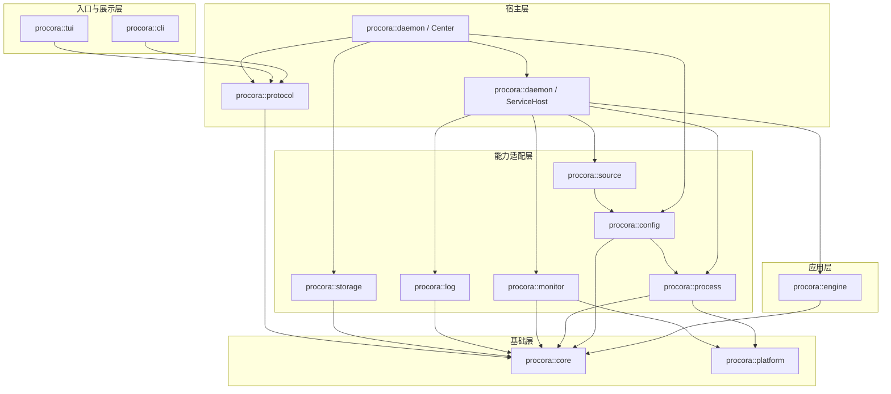

# 总体架构

## 1. 设计目标

Procora 面向本机多进程开发、持续任务和轻量部署场景。架构需要同时满足以下目标：

- 同一份任务定义可以在 Linux、macOS 和 Windows 上运行。
- 任务依赖、重启、健康检查和停止顺序由确定性的核心引擎管理。
- CLI、TUI、后台守护和观察客户端共享协议与业务语义。
- 配置、进程、日志、监测、定义源和平台能力能够独立演进与测试。
- 慢速终端、日志磁盘写入或指标采样不能阻塞任务状态机。
- 所有外部输入先经过校验和规范化，再进入运行时。

非目标包括容器编排、跨主机调度、内核级资源隔离和完整的系统服务管理。cgroup、Windows 服务、远程控制等能力可后续通过适配器增加，但不进入首个可用版本。

## 2. 架构原则

### 2.1 单向依赖

领域类型不依赖终端、操作系统或序列化格式。应用引擎只依赖领域模型和端口 trait；具体适配器实现端口，最终由入口程序完成装配。

### 2.2 单写者状态

每个 Service 只有一个引擎事件循环能够修改该服务的任务运行状态。Center 只路由服务级请求，不直接修改任意 Task 状态。进程退出、健康检查、配置更新和用户命令都转换为带身份信息的事件，由所属 Service 的引擎串行处理。

### 2.3 期望状态与观测状态分离

配置和用户命令描述 `DesiredState`，进程、检查器和监测器产生 `ObservedState`。引擎持续对账两者，不把“收到启动请求”等同于“任务已经运行”。

### 2.4 能力显式化

不同平台不能提供完全一致的资源指标与进程控制语义。平台层必须返回能力集合和“不可用”值，不允许使用零值伪装未支持的指标。

### 2.5 有界并发与背压

事件、日志、指标和客户端订阅使用分开的有界通道。控制事件优先于遥测事件；慢客户端只能丢弃或合并自己的遥测视图，不能阻塞子进程输出管道或核心状态机。

### 2.6 固定托管层级

运行时固定为 `Center → ServiceHost → Task`。当前用户只有一个 Center；每个服务名称与一个规范化目录和显式配置文件对应；Task 只在所属服务内唯一。Center 注册表不能退化为跨服务的全局 Task 表。

## 3. 逻辑分层



图中箭头表示模块依赖。适配器若要实现引擎定义的端口，可以依赖 `procora::engine` 的轻量 `ports` 子模块；引擎本身不得反向依赖适配器。若端口数量增长，应在 `src/ports/` 提取为独立模块，避免形成循环。

## 4. 单一 crate 布局

仓库使用单一 `procora` crate；原有逻辑边界保留为 `src/` 下的模块：

```text
procora/
├── Cargo.toml
├── Cargo.lock
├── src/
│   ├── lib.rs                  # 公共模块入口
│   ├── main.rs                 # procora 二进制入口
│   ├── core/                   # 领域类型、任务图、状态和值对象
│   ├── engine/                 # 命令、事件循环、调度、对账与端口
│   ├── config/                 # 多格式读取、合并、校验与规范化
│   ├── source/                 # 本地监听及后续 Git/HTTP 定义源
│   ├── process/                # 子进程启动、停止、退出与进程树
│   ├── monitor/                # 资源采样与聚合
│   ├── log/                    # 输出采集、索引、滚动与订阅
│   ├── storage/                # 状态快照、运行元数据与迁移
│   ├── platform/               # Linux/macOS/Windows 系统适配
│   ├── protocol/               # 版本化 IPC DTO 与编解码
│   ├── tui/                    # 终端状态、页面、组件与输入映射
│   ├── cli/                    # 命令定义、输出格式与客户端
│   └── daemon/                 # 组合根、后台服务与 IPC 服务端
├── tests/                      # 全部集成测试、共享支持代码与夹具
└── docs/
```

根 manifest 声明唯一的 `procora` package。`procora` 二进制位于 `src/main.rs`；全部集成测试位于根 `tests/`，共享代码放在 `tests/support/`，夹具放在 `tests/fixtures/`。

应在实际需求出现时才增加模块。模块内先按职责拆分文件；只有当业务边界足够清晰时才继续分目录，防止早期结构碎片化。

## 5. 模块职责

| 模块 | 负责 | 不负责 |
| --- | --- | --- |
| `procora::core` | `ServiceName`、`TaskId`、`ProjectSpec`、任务图、状态、事件值对象、错误分类 | 文件解析、异步运行时、系统调用 |
| `procora::engine` | 命令处理、调度、依赖判定、状态机、重启策略、配置对账 | 直接创建进程、写日志、绘制界面 |
| `procora::config` | 格式探测、include 合并、持久 profile 准入、命名 Task 模板、受控 Python JSON 前端、Raw DTO 反序列化、来源、路径规范化、校验、图编译 | 运行服务 Task、监听 UI；通用变量仍属后续能力 |
| `procora::source` | 发现、监听、拉取本地或 Git 任务定义，固定来源身份并生成带版本候选 | 直接应用配置或修改引擎状态 |
| `procora::process` | 启动进程、输出管道、信号/控制事件、退出观察、进程树回收 | 决定任务是否应该启动 |
| `procora::monitor` | 采样进程树资源、归一化、能力上报 | 重启或终止高占用任务 |
| `procora::log` | stdout/stderr 帧、内存尾部、Service 本地滚动文件、gzip 归档、游标查询 | 解释业务日志、集中保存全部 Service 日志或更改任务状态 |
| `procora::storage` | SQLite 服务注册、当前状态、状态历史、模式版本和恢复元数据 | 保存日志正文或作为运行期间的实时状态真相来源 |
| `procora::platform` | 进程组/Job Object、本地 IPC、目录和系统指标原语 | 调度、配置语义和展示 |
| `procora::protocol` | 请求、响应、事件 DTO，协议协商和编解码 | 复用内部对象内存布局作为线协议 |
| `procora::tui` | 终端页面、交互状态、筛选、图视图、日志与指标展示 | 直接访问配置文件或操作系统进程 |
| `procora::cli` | 命令行解析、人类/机器输出、连接生命周期 | 复制引擎规则 |
| `procora::daemon` | Center 注册表与路由、`ServiceHost` 装配、服务生命周期、本地 IPC | 承载可复用领域规则或把所有服务 Task 合并为全局图 |

## 6. 核心端口

端口 trait 应保持窄接口，并围绕领域动作而非底层库设计。名称仍属设计草案：

```rust
/// 启动和控制受监管的任务进程。
pub trait ProcessRuntime { /* spawn, stop, kill, inspect */ }

/// 写入并查询带顺序号的任务日志。
pub trait LogStore { /* append, tail, query, rotate */ }

/// 提供任务进程树的资源快照流。
pub trait ResourceMonitor { /* watch, snapshot, capabilities */ }

/// 持久化可恢复但非权威的运行元数据。
pub trait StateRepository { /* load, save_atomically */ }

/// 发现和拉取带版本的配置输入。
pub trait DefinitionSource { /* current, watch, fetch */ }
```

异步方法的具体表达应在脚手架阶段通过最小原型确定，避免过早绑定 `async_trait`、泛型关联类型或特定 channel 实现。端口错误必须映射为稳定的领域错误类别，同时保留内部错误链供诊断日志使用。

## 7. 关键数据流

### 7.1 配置进入运行时

```text
DefinitionSource
  → ConfigInput（来源、版本、原始内容）
  → 解析/合并/变量展开
  → 校验与规范化 ProjectSpec
  → 编译 TaskGraph
  → 生成 ConfigRevision 和差异
  → 用户确认或自动应用
  → Engine reconcile
```

任何阶段失败都保留上一份已生效配置。热更新不能先破坏当前任务再报告解析错误。

### 7.2 任务事件

```text
用户命令/配置差异/进程退出/检查结果
  → EngineCommand 或 RuntimeEvent
  → 单写者事件循环
  → 状态转换与副作用意图
  → Process/Log/Monitor 端口
  → 带 task_id + run_id + generation 的结果事件
  → IPC 事件流
  → CLI/TUI 视图模型
```

`run_id` 区分同一任务的不同进程实例，`generation` 区分不同配置修订。迟到事件若身份不匹配必须被忽略并记录诊断信息。

### 7.3 拉取与实时更新

任务定义源只产生候选修订，不直接控制任务。候选内容经过完整配置编译后生成差异；本地文件监听可按策略自动应用，远程源默认需要显式确认。应用过程应支持预览、原子切换和失败回滚到上一份已验证规范，而不是回滚已经发生的任意外部副作用。

## 8. 中心、服务宿主与客户端模型

- 嵌入模式：默认 `procora` 在没有 Center 时于当前进程运行一个 `ServiceHost`，其生命周期与 TUI 相同。
- 后台模式：当前用户唯一的 Center 持有多个 `ServiceHost` 和本地 IPC 监听端点，终端退出不影响已注册服务。
- 前端模式：客户端订阅状态、日志和指标，也可以在会话能力允许时提交控制命令；“观察”描述数据获取方式，不等于只读权限。
- TUI 模式：TUI 作为 IPC 前端；是否允许控制由握手返回的会话权限决定，而不是由界面自行假设。

嵌入与后台入口必须调用同一个 `ServiceHost` 装配函数，禁止维护两套 Task 调度路径。Center 只负责服务注册、定位和路由，不直接调度跨服务 Task。首版只支持单机本地 IPC；远程传输需要独立威胁模型、认证、加密和授权设计。

## 9. 协议与兼容性

本地协议使用显式 DTO，不直接序列化内部状态对象。握手至少包含：

- 协议主版本和客户端类型；尚未实现次版本协商。
- Center 实例 ID、已注册服务数量；进入服务会话后再交换服务名称和当前配置修订。
- 平台能力与服务端功能标志。
- 会话权限，例如 `observe`、`control`、`admin`。

同一主版本内只有带安全默认值的展示字段可以新增；请求、响应或事件枚举增加变体时提升主版本。客户端断线重连时先读取快照，再从事件序列号续订；若游标已过期则重新获取快照。完整决策见 [ADR 0001](adr/0001-versioning-and-compatibility.md)。

## 10. 持久化边界

引擎内存状态是运行期间的权威来源。当前 SQLite 持久化保存：

- 服务名称、目录、显式配置文件和运行期望。
- 服务当前状态、错误信息、任务数量与状态变更历史。

这些结构化状态由当前用户数据目录中的 SQLite 数据库保存，服务当前状态与状态历史使用事务更新。Center 实例 ID 每次启动重新生成；Task PID、run ID 和日志游标不进入 SQLite。日志正文明确不进入 SQLite：Service 和 Task 日志、轮转 gzip 归档都保存在所属 Service 的 `.procora/logs` 目录。

Center 恢复时不会凭 PID 接管旧进程，而是为需要运行的 Task 创建新的 generation 和 run ID。未来若支持跨 Center 接管，至少需要平台进程身份、启动时间和 Procora 生成的运行令牌共同验证；无法证明所有权时标记为 `orphaned`，默认不发送终止操作。

## 11. 安全边界

- 配置和任务命令具有执行本机代码的能力，只应加载可信来源。
- Python 配置只接受显式 `procora.py`，通过 `procora::process` 的进程组或 Job Object 在独立辅助进程中限时执行；环境和输出有界，但这不是安全沙箱。
- 默认使用参数数组启动程序，不经过 shell；显式 shell 模式需要清楚标注。
- IPC 端点限制为当前用户访问，敏感控制操作需服务端授权。
- 环境变量、命令参数和日志可能包含密钥，诊断输出应支持字段级脱敏。
- 远程任务源只产出候选配置；下载内容、来源身份和内容哈希应进入审计记录。
- Git 来源固定完整 commit 并在确认时重新获取；禁用 hooks/交互和危险协议，且远端 Python 配置不执行。

## 12. 架构守则

实现与评审时必须维护以下约束：

1. `procora::tui` 不依赖 `procora::process`、`procora::monitor` 或 `procora::config`。
2. `procora::engine` 不依赖任何 UI、具体平台实现或具体存储。
3. 适配器不能绕过引擎直接互相触发状态变化。
4. 线协议、配置 DTO 和领域模型分别定义，不共享“万能结构体”。
5. 所有跨异步边界的事件都携带任务、运行实例和配置修订身份。
6. 所有队列给出容量、溢出策略和可观测指标。
7. 平台能力缺失必须显式表达并由上层降级展示。
8. 关键 trait、结构体、函数和静态变量提供简短中文说明；单文件不超过 500 行。
