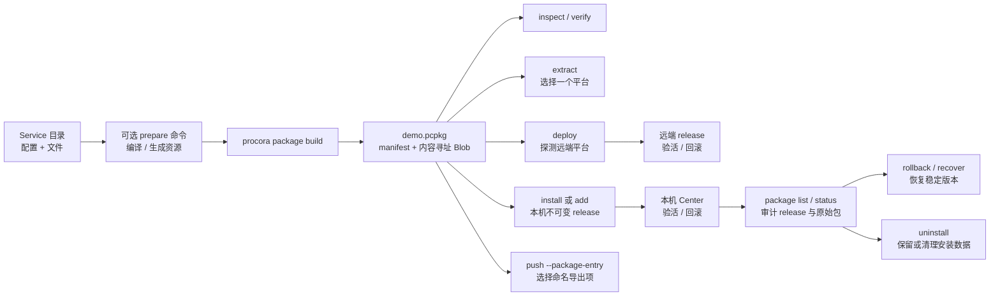

# Procora Service 包

`.pcpkg` 是一个可独立构建、检查、验证和按平台物化的 Service 包。它保存 Procora 配置、普通文件、一个或多个平台的预编译二进制，以及从 `uploads` 派生的命名导出项。包既可以是只含一个目标平台的薄包，也可以是同时携带多平台变体的胖包。

## 使用流程



直接运行 `procora` 时，在服务总览按 `p` 可进入“包工作台”。工作台保留两个稳定视图：

- “包文件”集中完成构建、打开、验证、解包、安装、临时运行、裸机部署和命名导出推送；从某个 Service 进入时自动绑定其目录作为构建上下文。按 `B` 可构建包、展示完整远端预检计划并在确认后部署，按 `b` 仍只构建，按 `d` 可预检并部署当前包。连续两次按 `Delete` 或大写 `X` 可永久删除当前 `.pcpkg`，即使其清单已经损坏也保留该恢复出口。
- “已安装”集中查看 active/pending release 与原始包；`R` 回滚最近历史版本，`c` 收敛中断安装，连续两次大写 `U` 解除包托管但保留数据，连续两次大写 `D` 永久删除该安装目录。

左右方向键移动当前折叠文本，`F3` 切换全部长路径、摘要和错误信息的自动横移；触控板横向滚动沿用相同语义。操作离开全屏页面后显示既有的阶段进度与交互向导，完成或失败都会返回原位置并给出结果。部署确认页固定展示 Service、SSH 目标、远端平台、二进制选择、内容大小、release 摘要和验收参数；取消不会修改远端。构建和解包遇到同名目标时自动选择带编号的新路径，不会隐式覆盖；新构建或打开的包会自动成为当前项，避免误操作旧包。从 Service 上下文部署同名包时，SSH 目标按 Service 根目录与 `project` 记忆，不受新包编号影响。

常用命令：

```bash
# 默认构建包含全部 binaries 变体的胖包
procora package build . --output demo.pcpkg

# 相同输入重复执行会复用已有包；内容不同时才需要显式替换
procora package build . --output demo.pcpkg --force

# 只构建当前平台的薄包
procora package build . --platform current
procora package build . --platform linux-x86_64-gnu

# 先运行一个或多个显式准备命令，再收集产物构建包
procora package build . \
  --prepare "python scripts/build_package.py"
procora package build . \
  --prepare "cargo build --release" \
  --prepare "python scripts/collect_assets.py"

# 准备、构建并通过现有验活/回滚协议直接部署
procora package build . \
  --prepare "python scripts/build_package.py" \
  --deploy prod

# 读取清单、完整验证 Blob、按平台解包
procora package inspect demo.pcpkg
procora package inspect demo.pcpkg --json
procora package verify demo.pcpkg
procora package extract demo.pcpkg --output ./unpacked

# 本机持久安装或临时运行；add/temp-run 也能直接接收包
procora package install demo.pcpkg
procora add demo.pcpkg
procora package run demo.pcpkg
procora temp-run demo.pcpkg

# 审计、回滚和恢复本机安装
procora package list
procora package status demo
procora package rollback demo
procora package rollback demo <release-id>
procora package recover demo

# 默认只解除 Center 注册并保留数据；--purge 才永久清理
procora package uninstall demo
procora package uninstall demo --purge

# 胖包会在探测 SSH 远端后只发送匹配平台内容
procora deploy demo.pcpkg --ssh prod --dry-run
procora deploy demo.pcpkg --ssh prod

# uploads 中的 assets 会成为同名导出项
procora push demo.pcpkg --package-entry assets --ssh prod
```

`push --package-entry assets` 未显式给出 `--target` 时默认使用 `<project>::assets`。普通资产通常使用默认的 `--package-platform current`；若导出路径依赖某个二进制变体，可显式传入 `--package-platform os-arch[-environment]`。

## 构建准备与一键部署

`--prepare <COMMAND>` 用于在打包前生成 `binaries` 引用的编译产物、前端静态资源或其他派生文件。该参数可以重复，每条命令都在 Service 根目录按声明顺序执行；任一命令失败就立即停止，不创建新包，也不会因 `--force` 提前移动已有包。

命令文本只负责安全拆分程序和参数，不经过 shell，不会隐式解释管道、重定向、变量替换或 `&&`。Python 脚本可直接写成：

```bash
procora package build . --prepare "python scripts/build_package.py"
```

需要 shell 语义时必须显式选择解释器，例如 `--prepare 'sh -c "make && make assets"'`；Windows 可显式使用 PowerShell。脚本继承当前用户环境，并额外获得以下稳定上下文：

| 环境变量 | 含义 |
| --- | --- |
| `PROCORA_PACKAGE_SOURCE` | 规范化后的 Service 根目录 |
| `PROCORA_PACKAGE_OUTPUT` | 将要写入的 `.pcpkg` 绝对路径 |
| `PROCORA_PACKAGE_PLATFORM` | `all` 或规范化目标平台键 |
| `PROCORA_PACKAGE_PROJECT` | 配置中的 Service 名称 |

准备命令只应生成包输入，不应自行调用 `procora package build` 或直接写入 `PROCORA_PACKAGE_OUTPUT`。Procora 会在命令全部成功后重新发现并校验配置、收集文件、生成确定性包并执行完整自校验。

Python 用户可直接运行 `python -m procora .`，默认输出 `dist/<service>.pcpkg`；或在脚本中调用 `procora.build()` 并读取 `BuildResult`。两种方式最终都调用同一 Rust 构建器和构建后自校验，详见 [Python API 与脚本化构建](python.md)。

`--deploy <SSH_TARGET>` 把成功构建或确认未变化的包直接交给现有裸机部署流程：

```bash
procora package build . \
  --platform all \
  --prepare "python scripts/build_package.py" \
  --deploy prod \
  --batch
```

部署仍会探测远端平台、只选择匹配变体、复核摘要、验活并在失败时回滚。部署失败不会删除刚构建且已经验证的包，修复远端问题后可直接运行 `procora deploy <包> --ssh <目标>` 重试。

## 包内容与确定性

`.pcpkg` v1 是 zstd 压缩的确定性 tar：

```text
manifest.json
blobs/sha256/ab/cdef...
signatures/...
```

- `manifest.json` 必须是第一个条目，格式标识为 `procora.package/v1`。
- 普通文件和二进制都通过 `sha256:<hex>` 引用 Blob；相同内容只保存一次。
- tar 条目顺序、所有者、时间戳和模式被规范化；输入内容与可执行位不变时，重复构建得到相同字节。
- 已有输出是同一逻辑包时，普通 `package build` 幂等成功并报告“包未变化”；已有输出内容不同时仍拒绝覆盖，只有 `--force` 会先创建可恢复备份再替换。
- 逻辑 package digest 是规范清单的 SHA-256。按平台物化后的 release digest 只取决于该平台实际得到的路径和 Blob，因此向胖包增加其他平台变体不会改变当前平台 release。
- `signatures/` 是保留命名空间；v1 能安全跳过有界签名条目，但当前版本尚未实现签名创建或信任策略。

清单中的所有路径都使用 `/`，必须是可移植相对路径。构建和验证会拒绝符号链接、特殊文件、父目录穿越、Windows 保留名称、不可移植字符和大小写冲突。解包拒绝覆盖已有目录；失败时会清理本次新建的目标。

## 文件选择

构建器总是排除：

- `.procora/` 运行数据；
- `.git/`；
- `.procoraignore` 本身；
- 各平台二进制 source 和 release target 的普通文件副本；
- 当前输出 `.pcpkg`。

根目录可创建 `.procoraignore`，语法与 gitignore 一致，但不会隐式继承 `.gitignore`：

```gitignore
node_modules/
target/
*.secret
!public/example.secret
```

配置入口不能被忽略。`binaries` 声明的构建产物不受普通忽略规则替代：准备命令完成后，被选中的变体必须是存在的非空普通文件，否则构建失败。

## 与本机和裸机 release 的关系

`package install` 与 `add some.pcpkg` 使用和裸机 deploy 相同的托管根目录语义：

```text
services/<project>/
  packages/<package-digest>.pcpkg
  releases/<release-digest-prefix>/
  state.json
  deploy.lock
```

安装先完整验证包，再按当前平台物化到 staging，重新加载包内 Procora 配置并复核 Service 身份和二进制摘要。切换前写入 pending 状态；全部 Task 通过启动、健康检查和稳定窗口后才确认活动 release。失败会恢复并重新验收上一版本，首次安装失败则移除失败注册。相同活动 release 已可用时幂等跳过。

`package rollback` 默认选择最近一个非活动 release，也可显式给出 release ID；目标版本仍需通过完整验活，失败时自动切回原活动版本。`package recover` 是幂等的中断恢复入口。`package uninstall` 默认只解除确实位于该安装目录中的 Center 注册并保留审计数据，只有明确指定 `--purge` 才删除 `services/<project>` 下的 release、状态和原始包。

若 Center 中存在同名但位于其他目录的普通 Service，解除和清理包安装都不会操作该 Service：默认解除会报告同名项已保留，`--purge` 只删除独立的包安装目录。即使 `state.json` 损坏、`releases` 缺失或原始包不可读，也不会形成既不能解除又不能删除的卡死项。

`deploy some.pcpkg` 不会先按开发机平台解包。它先通过 SSH 探测远端 OS、架构和 ABI，再从胖包选择唯一变体，生成现有托管部署归档；远端仍会独立复核平台、配置、路径、大小和 SHA-256，并继续使用原有验活与回滚状态机。薄包不包含远端所需变体时会在上传前失败。

## 配置执行边界

声明式 YAML、TOML 和 JSON 配置在构建时正常编译校验。显式 `procora.py` 仍属于可执行配置：构建会执行源配置，`package install`、`package run` 和 `deploy` 在物化后重新校验时也会执行包内配置。只查看不受信任包时使用 `package inspect` 或 `package verify`；这两个命令只解析严格清单和校验 Blob，不执行 Service 配置。
