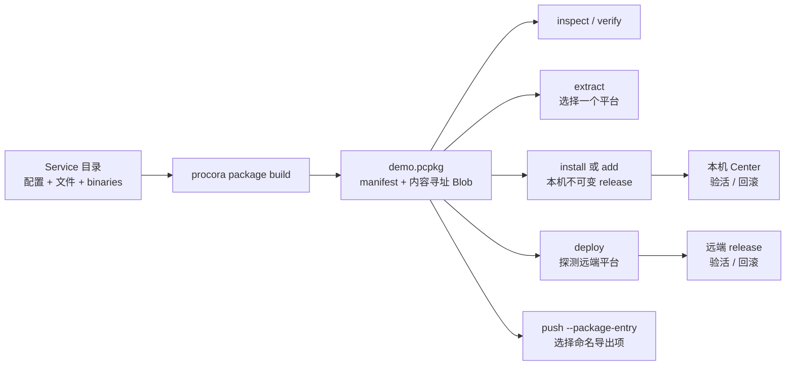

# Procora Service 包

`.pcpkg` 是一个可独立构建、检查、验证和按平台物化的 Service 包。它保存 Procora 配置、普通文件、一个或多个平台的预编译二进制，以及从 `uploads` 派生的命名导出项。包既可以是只含一个目标平台的薄包，也可以是同时携带多平台变体的胖包。

## 使用流程



常用命令：

```bash
# 默认构建包含全部 binaries 变体的胖包
procora package build . --output demo.pcpkg

# 只构建当前平台的薄包
procora package build . --platform current
procora package build . --platform linux-x86_64-gnu

# 读取清单、完整验证 Blob、按平台解包
procora package inspect demo.pcpkg
procora package inspect demo.pcpkg --json
procora package verify demo.pcpkg
procora package extract demo.pcpkg --output ./unpacked

# 本机持久安装或临时运行；add/temp-run 也能直接接收包
procora package install demo.pcpkg
procora add demo.pcpkg
procora package run demo.pcpkg
procora temp-run demo.pcpkg

# 胖包会在探测 SSH 远端后只发送匹配平台内容
procora deploy demo.pcpkg --ssh prod --dry-run
procora deploy demo.pcpkg --ssh prod

# uploads 中的 assets 会成为同名导出项
procora push demo.pcpkg --package-entry assets --ssh prod
```

`push --package-entry assets` 未显式给出 `--target` 时默认使用 `<project>::assets`。普通资产通常使用默认的 `--package-platform current`；若导出路径依赖某个二进制变体，可显式传入 `--package-platform os-arch[-environment]`。

## 包内容与确定性

`.pcpkg` v1 是 zstd 压缩的确定性 tar：

```text
manifest.json
blobs/sha256/ab/cdef...
signatures/...
```

- `manifest.json` 必须是第一个条目，格式标识为 `procora.package/v1`。
- 普通文件和二进制都通过 `sha256:<hex>` 引用 Blob；相同内容只保存一次。
- tar 条目顺序、所有者、时间戳和模式被规范化；输入内容与可执行位不变时，重复构建得到相同字节。
- 逻辑 package digest 是规范清单的 SHA-256。按平台物化后的 release digest 只取决于该平台实际得到的路径和 Blob，因此向胖包增加其他平台变体不会改变当前平台 release。
- `signatures/` 是保留命名空间；v1 能安全跳过有界签名条目，但当前版本尚未实现签名创建或信任策略。

清单中的所有路径都使用 `/`，必须是可移植相对路径。构建和验证会拒绝符号链接、特殊文件、父目录穿越、Windows 保留名称、不可移植字符和大小写冲突。解包拒绝覆盖已有目录；失败时会清理本次新建的目标。

## 文件选择

构建器总是排除：

- `.procora/` 运行数据；
- `.git/`；
- `.procoraignore` 本身；
- 各平台二进制 source 和 release target 的普通文件副本；
- 当前输出 `.pcpkg`。

根目录可创建 `.procoraignore`，语法与 gitignore 一致，但不会隐式继承 `.gitignore`：

```gitignore
node_modules/
target/
*.secret
!public/example.secret
```

配置入口不能被忽略。`binaries` 声明的构建产物不受普通忽略规则替代：被选中的变体必须是存在的非空普通文件，否则构建失败。

## 与本机和裸机 release 的关系

`package install` 与 `add some.pcpkg` 使用和裸机 deploy 相同的托管根目录语义：

```text
services/<project>/
  packages/<package-digest>.pcpkg
  releases/<release-digest-prefix>/
  state.json
  deploy.lock
```

安装先完整验证包，再按当前平台物化到 staging，重新加载包内 Procora 配置并复核 Service 身份和二进制摘要。切换前写入 pending 状态；全部 Task 通过启动、健康检查和稳定窗口后才确认活动 release。失败会恢复并重新验收上一版本，首次安装失败则移除失败注册。相同活动 release 已可用时幂等跳过。

`deploy some.pcpkg` 不会先按开发机平台解包。它先通过 SSH 探测远端 OS、架构和 ABI，再从胖包选择唯一变体，生成现有托管部署归档；远端仍会独立复核平台、配置、路径、大小和 SHA-256，并继续使用原有验活与回滚状态机。薄包不包含远端所需变体时会在上传前失败。

## 配置执行边界

声明式 YAML、TOML 和 JSON 配置在构建时正常编译校验。显式 `procora.py` 仍属于可执行配置：构建会执行源配置，`package install`、`package run` 和 `deploy` 在物化后重新校验时也会执行包内配置。只查看不受信任包时使用 `package inspect` 或 `package verify`；这两个命令只解析严格清单和校验 Blob，不执行 Service 配置。
